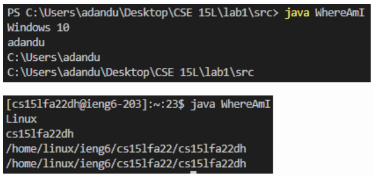
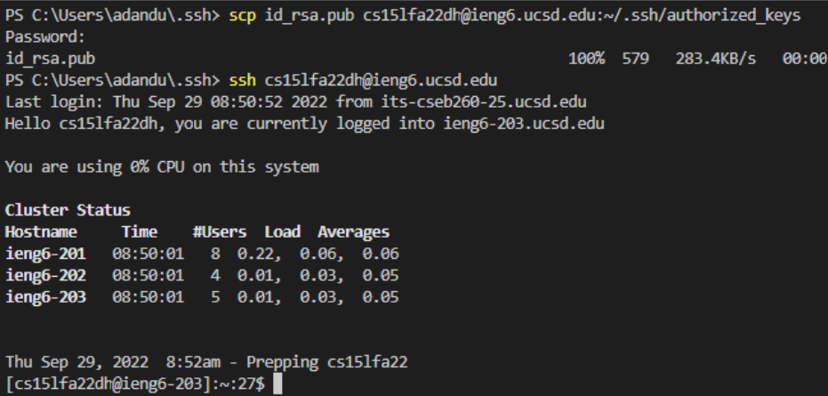
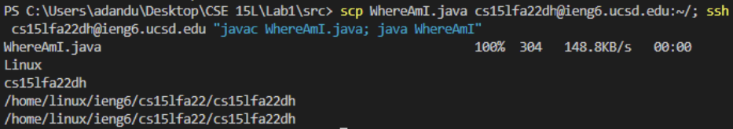

## Lab Report 1 - Week 1
# Part 3

# Part 4

# Part 5
cd perl5; ls - this navigates to the perl5 directory and prints the contents. As there was no output, the folder is empty.

# Part 6

What’s different about the output when you run this on the client vs. the server? What does this mean for what getProperty does?

The OS, user, home directory, and working directories differ between the two computers. This means that the output of getProperty is dependent on the system on which it is run.

In total, copying the file and running it takes about 30 seconds. Over the course of a PA, this could take 3000 seconds.

# Part 7

By eliminating the two password entry steps, about 6 seconds are saved per run.

# Part 8

