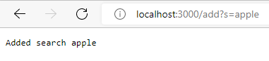
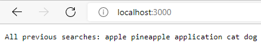
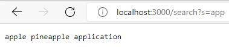

# Part 1
```java
import java.io.IOException;
import java.net.URI;
import java.util.ArrayList;
import java.util.List;

class Handler implements URLHandler {
    // The one bit of state on the server: a number that will be manipulated by
    // various requests.
    List<String> searches = new ArrayList<>();
    

    private String output(String substring) {
        String output = "";
        if(substring.equals("")) {
            for(String search : searches) {
                output += search + " ";
            }
        } else {
            for(String search : searches) {
                if(search.contains(substring)) {
                    output += search + " ";
                }
            }
        }
        return output;
    }

    public String handleRequest(URI url) {
        if (url.getPath().equals("/")) {
            return "All previous searches: " + output("");
        } else {
            System.out.println("Path: " + url.getPath());
            if (url.getPath().contains("/add")) {
                String[] parameters = url.getQuery().split("=");
                if (parameters[0].equals("s")) {
                    searches.add(parameters[1]);
                    return "Added search.";
                }
            } else if (url.getPath().contains("/search")) {
                String[] parameters = url.getQuery().split("=");
                if (parameters[0].equals("s")) {
                    return output(parameters[1]);
                }
            } else if (url.getPath().contains("/remove")) {
                String[] parameters = url.getQuery().split("=");
                if (parameters[0].equals("s")) {
                    if(searches.remove(parameters[1])) {
                        return "Removed " + parameters[1];
                    } else {
                        return parameters[1] + " has not been searched.";
                    }
                }
            } else if (url.getPath().contains("/clear")) {
                searches.clear();
                return "Cleared searches.";
            }
            return "404 Not Found!";
        } 
    }
}

class SearchEngine {
    public static void main(String[] args) throws IOException {
        if(args.length == 0){
            System.out.println("Missing port number! Try any number between 1024 to 49151");
            return;
        }

        int port = Integer.parseInt(args[0]);

        Server.start(port, new Handler());
    }
}
```



This results in url.getQuery().split("="), parameters[0].equals("s"), and searches.add(parameters[1]) being called. "searches" is an ArrayList containing all previous searches.
After this path is visited with a valid query, a string is added to searches.



This runs output(""), which returns a string that contains all previous searches from the searches ArrayList when the argument is "".



This runs output(parameters[1]), which returns a string that contains all strings in the searches ArrayList that contain parameters[1].

# Part 2

```java
 @Test 
 public void testReverseInPlaceNonSymmetric() {
 	int[] input1 = {1, 2, 3, 4, 5};
 	ArrayExamples.reverseInPlace(input1);
 	assertArrayEquals(new int[]{5, 4, 3, 2, 1 }, input1);
 }
  ```
  
  Symptom: the returned array is mirrored about middle element instead of being reversed.
  
  Bug: the method should first create a temporary copy of the input array so the array does not reference its own modified values when reversing itself. 
  
  Connection: After crossing the middle element of the array, the array looks at the first half of itself, the half that has already been modified to reflect the second half of the array. This causes the array to be mirrored around the middle element.
 
```java
 @Test
 public void testFilterMultiple() {
 	List<String> list = new ArrayList<>();
        list.add("a");
        list.add("b");
        list.add("c");
        assertEquals(list, ListExamples.filter(list, new TrueCheck()));
 }
    ```
 Symptom: the returned list is in reverse order.
 
 Bug: the method adds each element of the input list at index 0, when it should simply add them to the end.
 
 Connection: since each element is added at index 0, the last element of the list will be placed at the beginning of the returned list, indicating the list was reversed.
