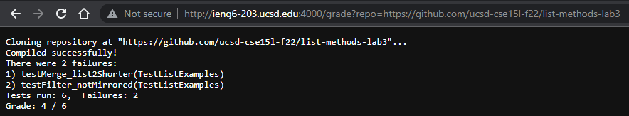
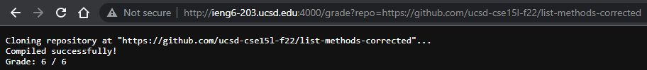
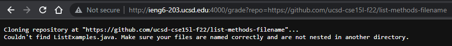

# grade.sh

```bash

rm -rf student-submission
rm -f *.class

git clone $1 student-submission > out.txt 2> err.txt 

if [ $? -ne 0 ]; then
    echo "Could not clone repository at \"$1\". Make sure the link is correct."
    exit 1
else
    echo "Cloning repository at \"$1\"..."	
fi

if [ -f student-submission/ListExamples.java ]; then
	cp ./student-submission/ListExamples.java ./
	javac -cp .:lib/hamcrest-core-1.3.jar:lib/junit-4.13.2.jar *.java > out.txt 2> err.txt
	if [ $? == 0 ]; then
	        echo "Compiled successfully!"
	else
        	echo "Compilation error!"
        	exit 1
	fi
else
 	echo "Couldn't find ListExamples.java. Make sure your files are named correctly and are not nested in another directory."
	exit 1	
fi

java -cp .:lib/hamcrest-core-1.3.jar:lib/junit-4.13.2.jar org.junit.runner.JUnitCore TestListExamples > out.txt 2> err.txt
grep -E 'There were |There was |[[:digit:]]\) test|Tests run: ' out.txt
cat out.txt | head -n 2 | tail -n 1 > tests.txt

ERRORS=$(grep -o 'E' tests.txt | wc -l | xargs)
TOTAL_TESTS=$(grep -o '\.' tests.txt | wc -l | xargs)
CORRECT=$(( $TOTAL_TESTS - $ERRORS ))

echo "Grade: $CORRECT / $TOTAL_TESTS"
```
# Examples with GradeServer

## Example 1


## Example 2


## Example 3


# Tracing Example 3

1: `rm -rf student-submission`\
stdout:\
stderr:\
exit code: 0

2: `rm -f *.class`\
stdout:\
stderr:\
exit code: 0

4: `git clone $1 student-submission > out.txt 2> err.txt` \
stdout: Cloning into 'student-submission'... [cont.]\
stderr: \
exit code: 0

6: `if [ $? -ne 0 ]; then`\
Evaluates to false, as the git clone was successful\
Lines 7-8 do not run as the previous if statement was false.

10: `echo "Cloning repository at \"$1\"..."`\
stdout: Cloning repository at "https://github.com/ucsd-cse15l-f22/list-methods-filename"... \
stderr:\
exit code: 0

13: `[ -f student-submission/ListExamples.java ]; then`\
Evaluates to false, as the file is named ListMethods.java instead of ListExamples.java, and thus cannot be found.\
Lines 14-21 do not run as the previous if statement was false.

23: `echo "Couldn't find ListExamples.java. Make sure your files are named correctly and are not nested in another directory."`\
stdout: Couldn't find ListExamples.java. Make sure your files are named correctly and are not nested in another directory.\
stderr: \
exit code: 0

24: `exit 1`\
Program exits early here since the file was not found, so lines 25-end do not run.


