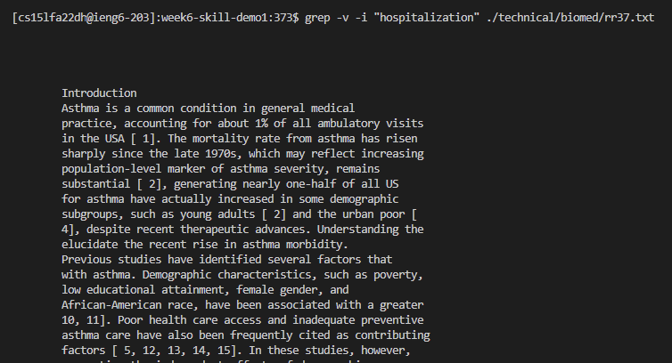

# grep examples
## grep -c

```
input: grep -c "asthma" ./technical/biomed/rr37.txt
output: 145

input: grep -c "hospitalization" ./technical/biomed/rr37.txt
output: 91

input: grep -c "subject" ./technical/biomed/rr37.txt
output: 30
```

The "-c" flag prints the number of lines that contain the input string rather than the lines themselves. This is useful as it more concise and straightforward than using grep on wc output to find the matching lines.

## grep -i

```
input: grep -i "asthma" ./technical/biomed/rr37.txt

```


```
input: grep -i "hospitalization" ./technical/biomed/rr37.txt
```


```
input: grep -i "subject" ./technical/biomed/rr37.txt
```


The "-i" flag prints the lines that contain the input string, ignoring letter cases. This is useful in cases where you wish to find all instances of a substring in any form; without the flag, you would not match lines where the word is the first in the sentence without explicitly capitalizing the word in the search.

## grep -v

```
input: grep -v "asthma" ./technical/biomed/rr37.txt
```


```
input: grep -v "hospitalization" ./technical/biomed/rr37.txt
```



```
input: grep -v -e '^[[:space:]]*$' ./technical/biomed/rr37.txt
```


The "-v" flag prints the lines that do not contain the input string. One useful case is shown in the third example, where we can use -v alongside regex matching in the case we want to filter out all empty lines that artificially contribute to the line count.
