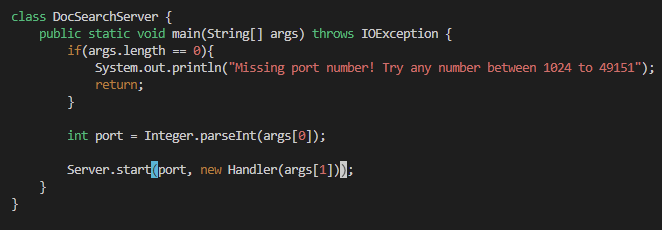
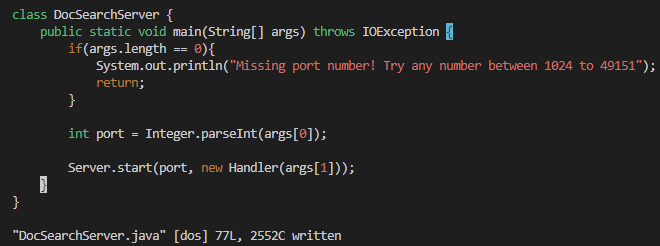

# Part 1
# Make main method in DocSearchServer.java use the second command line argument instead of being hardcoded

## `/r("<Enter>`
  

  
## `c$`
  

  
## `r(args[1]));<Esc>`
  

  
## `:w<Enter>`
  

  
# Part 2
  
First method took 50 seconds, second method took 30.

I would prefer using the second method; scp (and typing in my password multiple times) can sometimes be a bit slow, while simply editing in Vim can actually be pretty fast with the right commands. 

The gap could be bridged a bit if I had an RSA key on this computer, but I still think Vim would be faster overall.

If the modifications to the code were not as simple as the example I chose, however, I would probably use the first method. 
This is because I am used to the features, such as code autocomplete and error highlighting, offered by VSCode.
